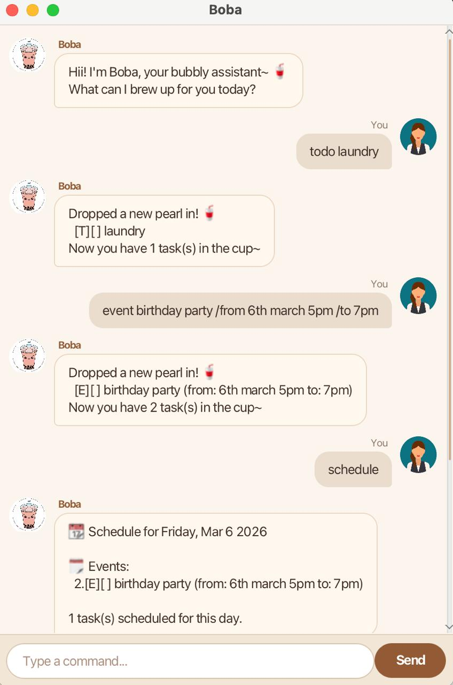

# Boba User Guide

Boba is your bubbly, boba-tea-obsessed personal task manager. She helps you track todos, deadlines, events, and much more -- all through a friendly chat interface.



## Quick Start

1. Ensure you have **Java 21** installed.
2. Download the latest `boba.jar` from the [Releases](https://github.com/) page.
3. Run it:
   ```
   java -jar boba.jar
   ```
4. Start typing commands in the input box and press **Send** or hit **Enter**.

## Features

### Adding a todo: `todo`

Adds a simple task with no date.

Format: `todo <description>`

Example: `todo buy boba tea`

```
Dropped a new pearl in! 🥤
  [T][ ] buy boba tea
Now you have 1 task(s) in the cup~
```

### Adding a deadline: `deadline`

Adds a task with a due date.

Format: `deadline <description> /by <date>`

Example: `deadline submit essay /by 2026-03-10`

```
Dropped a new pearl in! 🥤
  [D][ ] submit essay (by: Mar 10 2026)
Now you have 2 task(s) in the cup~
```

### Adding an event: `event`

Adds a task with a start and end time.

Format: `event <description> /from <start> /to <end>`

Example: `event birthday party /from 6th March 5pm /to 7pm`

```
Dropped a new pearl in! 🥤
  [E][ ] birthday party (from: 6th March 5pm to: 7pm)
Now you have 3 task(s) in the cup~
```

### Adding a do-after task: `doafter`

Adds a task that should be done after a condition is met.

Format: `doafter <description> /after <condition>`

Example: `doafter return book /after exam`

```
Dropped a new pearl in! 🥤
  [DA][ ] return book (after: exam)
Now you have 4 task(s) in the cup~
```

### Adding a do-within task: `dowithin`

Adds a task that must be completed within a time period.

Format: `dowithin <description> /between <start> /and <end>`

Example: `dowithin collect cert /between Jan 15 /and Jan 25`

```
Dropped a new pearl in! 🥤
  [DW][ ] collect cert (between: Jan 15 and: Jan 25)
Now you have 5 task(s) in the cup~
```

### Adding a fixed-duration task: `fixed`

Adds an unscheduled task that takes a known amount of time.

Format: `fixed <description> /needs <duration>`

Example: `fixed read report /needs 2 hours`

```
Dropped a new pearl in! 🥤
  [FD][ ] read report (needs: 2 hours)
Now you have 6 task(s) in the cup~
```

### Adding a tentative event: `tentative`

Adds an event with multiple possible time slots (at least 2). You can confirm one later.

Format: `tentative <description> /slot <from> - <to> /slot <from> - <to>`

Example: `tentative team meeting /slot Mon 2pm - 4pm /slot Tue 3pm - 5pm`

```
Dropped a new pearl in! 🥤
  [TE][ ] team meeting
    Slot 1: Mon 2pm - 4pm
    Slot 2: Tue 3pm - 5pm
Now you have 7 task(s) in the cup~
```

### Confirming a tentative event: `confirm`

Locks in one time slot for a tentative event.

Format: `confirm <task#> /slot <slot#>`

Example: `confirm 7 /slot 1`

```
Sealed the lid! Your event is set 🥤
  [E][ ] team meeting (from: Mon 2pm to: 4pm)
```

### Listing all tasks: `list`

Shows all tasks currently tracked.

Format: `list`

### Marking a task as done: `mark`

Marks a task as completed.

Format: `mark <task#>`

Example: `mark 1`

```
Nice, one less pearl to chew on! 🥤
[T][X] buy boba tea
```

### Unmarking a task: `unmark`

Marks a task as not done.

Format: `unmark <task#>`

Example: `unmark 1`

```
No rush~ let it steep a little longer!
[T][ ] buy boba tea
```

### Deleting a task: `delete`

Removes a task from the list.

Format: `delete <task#>`

Example: `delete 3`

```
Tossed it out like old tea leaves~
  [E][ ] birthday party (from: 6th March 5pm to: 7pm)
Now you have 6 task(s) in the cup.
```

### Finding tasks: `find`

Searches for tasks by keyword.

Format: `find <keyword>`

Example: `find book`

```
Found these matching pearls! 🥤
1.[DA][ ] return book (after: exam)
```

### Snoozing a task: `snooze`

Reschedules a deadline or event to a new date/time.

**For deadlines:**

Format: `snooze <task#> /to <new date>`

Example: `snooze 2 /to 2026-03-15`

**For events:**

Format: `snooze <task#> /from <start> /to <end>`

Example: `snooze 3 /from 2026-03-12 /to 2026-03-13`

```
Pushed it back~ new brew time 🥤
  [D][ ] submit essay (by: Mar 15 2026)
```

### Recurring tasks: `/every`

Make any task repeat automatically when marked done.

Add `/every <frequency>` to any task command. Frequency: `daily`, `weekly`, or `monthly`.

Example: `todo standup /every weekly`

When you mark a recurring task as done, a new occurrence is automatically created.

### Viewing reminders: `remind`

Shows overdue tasks and tasks due within the next 7 days.

Format: `remind`

Reminders also appear automatically when Boba starts up.

### Viewing your schedule: `schedule`

Shows all tasks scheduled for a specific date.

Format: `schedule [date]`

- `schedule` -- shows today's schedule
- `schedule 2026-03-10` -- shows schedule for that date

### Finding free time: `freetime`

Shows your availability for the next 7 days, or finds a day with enough free hours.

Format: `freetime [hours]`

- `freetime` -- shows a 7-day overview
- `freetime 3` -- finds the next day with 3+ free hours

### Boba recommendation: `boba`

Get a random boba tea recommendation.

Format: `boba`

```
🥤 Today I recommend...

  ⭐ Taro Milk Tea
  Creamy purple goodness~ sweet and nutty like a hug in a cup.

Wanna hear another? Just type boba again!
```

### Motivational quote: `cheer`

Get a random motivational quote.

Format: `cheer`

### Exiting: `bye`

Says goodbye and closes the session.

Format: `bye`

## Anomaly Detection

Boba automatically warns you when:
- You add a **duplicate task** (same description as an existing task)
- Two **events clash** (overlapping times)
- A **deadline is already past**

## Error Handling

If you make a mistake, Boba gives you a helpful hint with the correct format and a concrete example. Common mistakes like forgetting a slash (`by` instead of `/by`) or using a task name instead of a number are detected with specific guidance.

## Data Storage

Tasks are saved automatically to `./data/boba.txt` after every change. They are loaded automatically when Boba starts. No manual saving needed.

## Command Summary

| Command | Format |
|---------|--------|
| Todo | `todo <desc>` |
| Deadline | `deadline <desc> /by <date>` |
| Event | `event <desc> /from <start> /to <end>` |
| Do After | `doafter <desc> /after <condition>` |
| Do Within | `dowithin <desc> /between <start> /and <end>` |
| Fixed Duration | `fixed <desc> /needs <duration>` |
| Tentative | `tentative <desc> /slot <from> - <to> /slot ...` |
| Confirm | `confirm <task#> /slot <slot#>` |
| List | `list` |
| Mark | `mark <task#>` |
| Unmark | `unmark <task#>` |
| Delete | `delete <task#>` |
| Find | `find <keyword>` |
| Snooze | `snooze <task#> /to <date>` |
| Recurring | Add `/every daily\|weekly\|monthly` to any task |
| Remind | `remind` |
| Schedule | `schedule [date]` |
| Free Time | `freetime [hours]` |
| Boba | `boba` |
| Cheer | `cheer` |
| Exit | `bye` |
